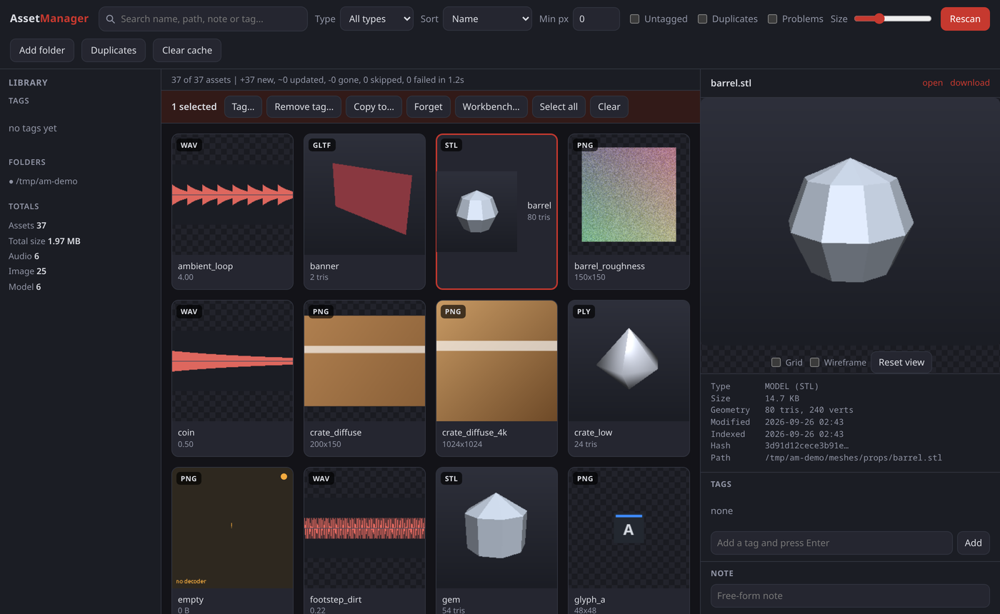
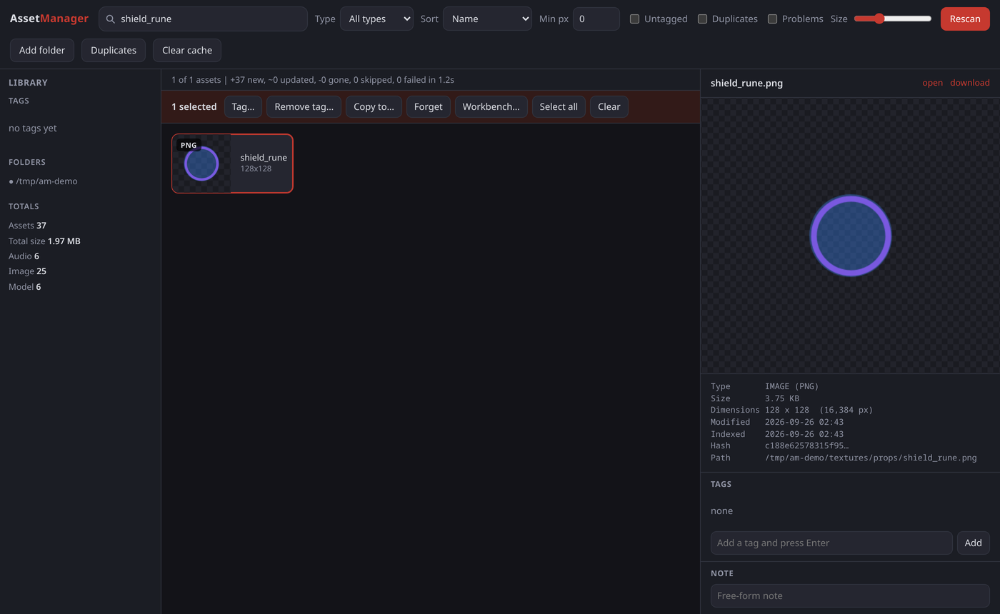
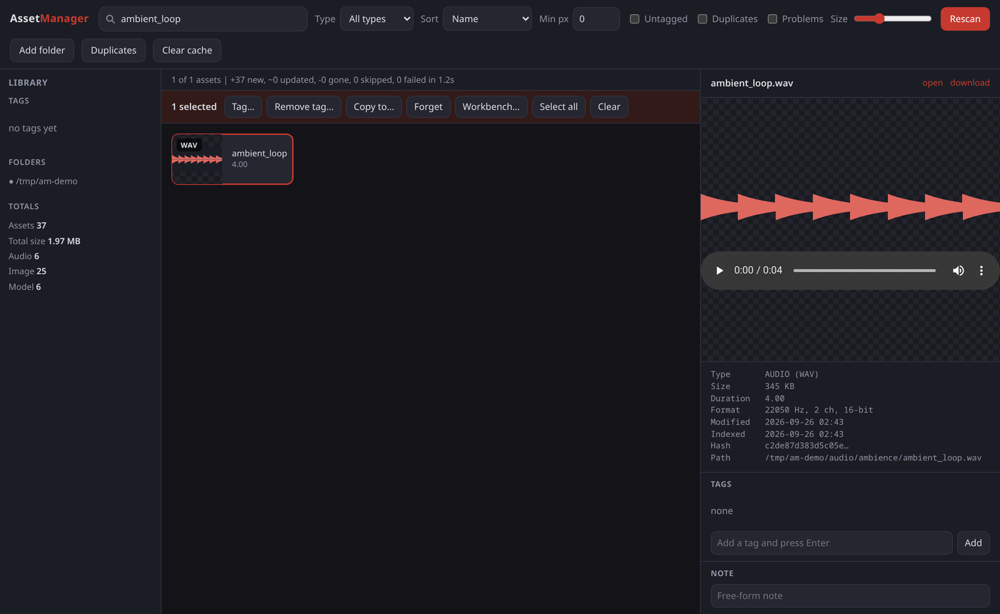
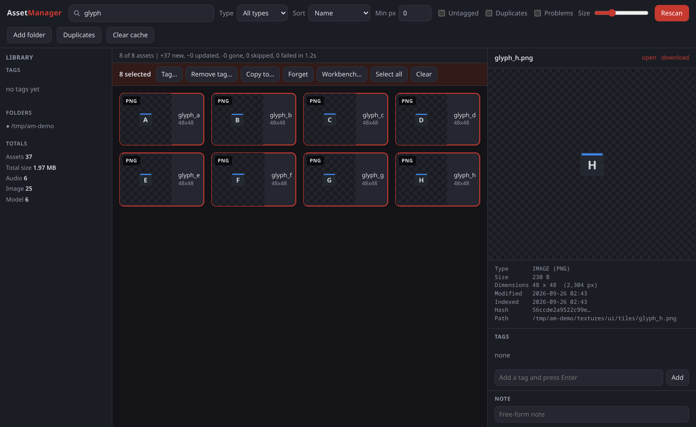
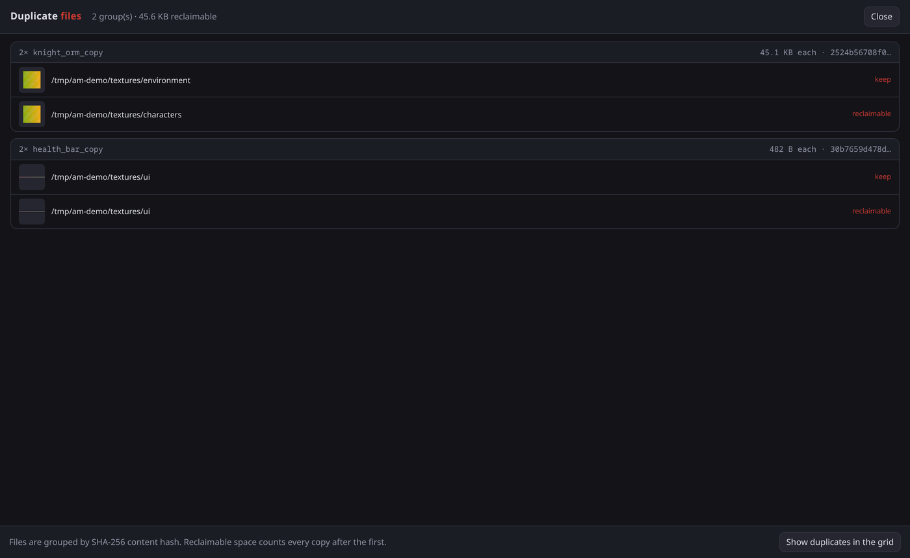
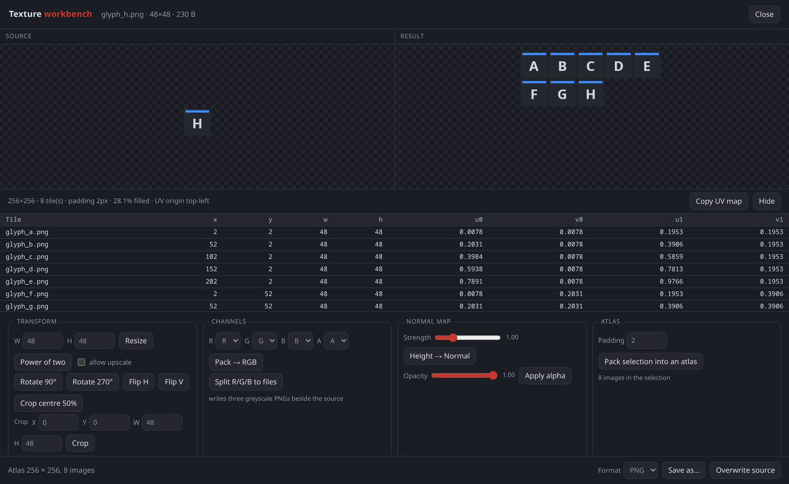

# AssetManager

A local asset browser for game development. It indexes asset folders into a
SQLite library, generates a thumbnail for every image, sound and 3D model, and
lets you preview, tag, search and batch-manage them from a browser.

Java 11, served over HTTP to a browser. 20 jars, no build tool.



## Running it

```bash
./fetch-libs.sh     # download the 20 runtime jars into ./lib  (~16 MB)
./build.sh          # compile to ./bin and package ./assetmanager.jar
./run.sh            # serve the UI and open it in your browser
```

```bash
./run.sh ~/games/mygame/assets
```

| Command | Effect |
|---|---|
| `./run.sh` | Serve the UI and open a browser |
| `./run.sh --no-open` | Serve it without launching a browser |
| `./run.sh ~/assets` | Index a folder, or an individual file, at startup |

No assets to hand:

```bash
./devtools/seed-demo-assets.sh              # write ./demo-assets and serve it
./devtools/seed-demo-assets.sh --no-serve   # just write the files
```

The generator writes 41 synthetic files, including a duplicate pair and a few
deliberately broken ones.

State lives in `~/.assetmanager/`:

```
~/.assetmanager/library.db     SQLite index
~/.assetmanager/cache/thumbs/  generated thumbnails
~/.assetmanager/cache/peaks/   waveform peak data
```

The server binds to `127.0.0.1` on an ephemeral port. Scanning, thumbnailing,
waveform extraction, 3D rendering and image operations run in the Java process.

## Features

**Grid.** Adjustable density. Images get scaled bitmaps, audio gets a waveform
strip, 3D models get a shaded still. Thumbnails are cached on disk, keyed by path,
mtime and size.

**Preview pane.** Per type: an image viewer with zoom and an alpha checkerboard, an
audio player with a clickable waveform, or a 3D viewport with orbit, pan and zoom.
Rendering is server-side, with an LRU cache keyed by asset id.

**Search and filters.** Name, path, note and tag. Filters for type, minimum
resolution, tag, untagged-only, duplicates-only and problems-only.

**Selection.** Click, Ctrl+click, Shift+click. Tag, untag, copy into a folder, or
forget, across the whole selection. Forget drops the asset from the library and
leaves the file on disk.

**Tags and notes.** Tags are clickable in the sidebar. Any file takes a free-form
note.

**Duplicates.** Grouped by SHA-256 content hash, with reclaimable space totalled.

**Folder watching.** Re-indexes after a short quiet period.

**Texture workbench.** Select images, then Workbench. Resize, power-of-two, crop,
rotate, flip, channel split, channel pack, heightmap to normal map with adjustable
Sobel strength, alpha scaling, and atlas packing of the whole selection. Padding is
a gutter on all four sides of every tile. Results save as a new file or overwrite
the original, written through a temp file and renamed into place.

The atlas placement map, pixel rectangles and matching UVs, is shown as a table and
copyable as JSON.

## Screenshots

| | |
|---|---|
| **Image viewer.** Zoom and an alpha checkerboard.<br> | **Audio.** Waveform from decoded peak data.<br> |
| **Multi-select.** Click, Ctrl+click, Shift+click.<br> | **Duplicates.** Grouped by content hash.<br> |



## Implementation

- **3D rendering** is a z-buffered software rasteriser written from scratch:
  near-plane clipping, backface culling, Blinn-Phong shading, perspective-correct
  texture mapping. No LWJGL, no OpenGL, no native code.
  See [`preview/SoftRenderer.java`](src/main/java/com/assetmanager/preview/SoftRenderer.java).
- **Model formats**: OBJ with MTL, glTF 2.0 and GLB, STL, PLY.
- **Atlas packing** is a skyline packer placing each tile by its footprint, the
  image plus its gutter.
  See [`tools/AtlasPacker.java`](src/main/java/com/assetmanager/tools/AtlasPacker.java).
- **Thumbnails** carry a render version in the on-disk name and in the URL the
  browser requests, so a change to how a tile looks cannot be masked by a cache.
  Waveform peaks are unversioned, being a measurement of the audio rather than a
  rendering of it.
  See [`core/ThumbnailService.java`](src/main/java/com/assetmanager/core/ThumbnailService.java).
- **ImageIO plugins are optional.** A plugin that fails to initialise gives that one
  file a "no decoder" state rather than aborting the scan.

## Project layout

```
src/main/java/com/assetmanager/
├── AssetManagerApp.java        entry point: open the library, serve the UI
├── core/
│   ├── Database.java           SQLite connection and schema
│   ├── AssetStore.java         every query in the app
│   ├── AssetScanner.java       folder walk, probe, upsert, prune
│   ├── AssetWatcher.java       WatchService with debounced batched rescans
│   ├── ThumbnailService.java   background thumbnail + waveform cache
│   ├── MetaProbe.java          dimensions, duration, poly counts
│   ├── Waveform.java           decode-to-peaks envelope
│   ├── Hashing.java            SHA-256 for duplicate detection
│   └── mesh/                   OBJ / glTF / STL / PLY loaders, Mesh, Material, ModelData
├── preview/
│   └── SoftRenderer.java       z-buffered software rasteriser
├── tools/
│   ├── ImageOps.java           resize / crop / channels / normal map
│   └── AtlasPacker.java        skyline bin packer
├── util/                       formats, images, logging, matrix maths
├── web/
│   ├── WebUi.java              HTTP server, routes, JSON responses
│   └── Json.java               response shaping and escaping
└── devtools/
    └── DemoAssets.java         generates the synthetic demo tree

src/main/resources/web/         index.html, app.css, app.js
```

## Supported formats

| Kind | Formats |
|---|---|
| Images (read) | PNG, JPEG, GIF, BMP, TIFF, WebP, PSD/PSB, TGA, PCX, DDS, HDR/EXR, WBMP, ICO, WMF |
| Images (write) | PNG, JPEG, TIFF, BMP, GIF, WBMP, ICO, PSD/PSB, whatever the platform's ImageIO provides |
| Audio | WAV, AIFF, AU, MP3, OGG Vorbis |
| 3D (preview) | OBJ (+MTL), glTF 2.0 / GLB, STL (ascii and binary), PLY (ascii and binary) |
| 3D (indexed only) | FBX, 3DS, Collada, Blend |


## Keyboard

| Shortcut | Action |
|---|---|
| `/` | focus search |
| `Ctrl`+`A` | select all |
| `F2` | add a tag to the selection |
| `Delete` | forget the selection, files are kept |
| `W` | open the workbench on the selected image |
| `Esc` | close a sheet, otherwise clear the tag filters |
| Click | select |
| `Ctrl`+click | toggle one |
| `Shift`+click | extend the range from the last click |

